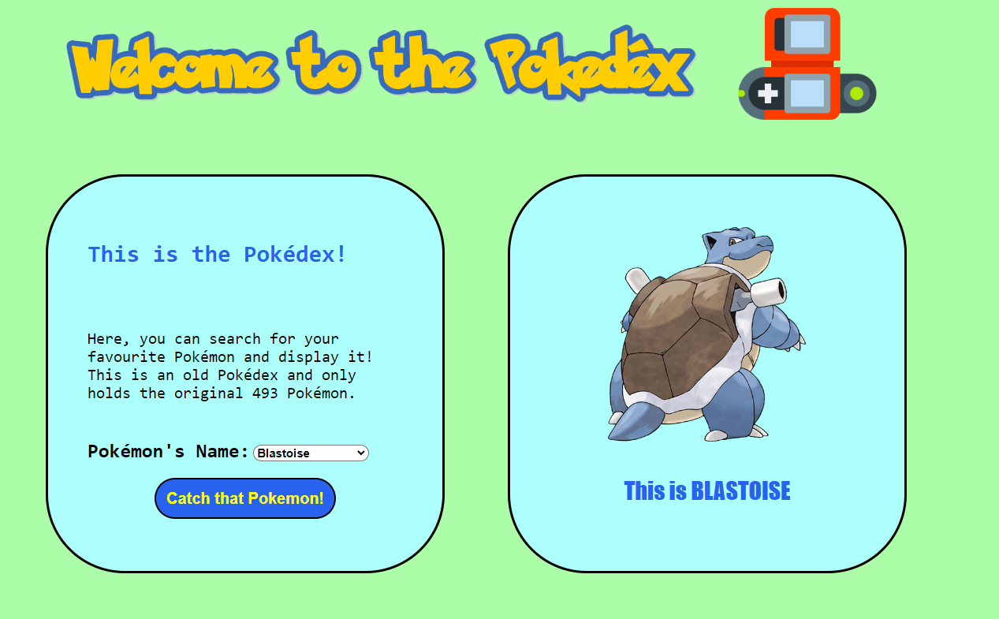

#  Pokédex
A Pokédex built with HTML, CSS and Javascript to display the first generation Pokémon. Additions to be made at a later date. This was a fun and short little side project for someone (like myself) who has just started learning web development.

## Tutorial
I followed a <a href="https://www.youtube.com/watch?v=BV93gRuIgIA"> tutorial </a> from Coders for Causes (CFC) for this personal project to get me started.

## External Tools
I used <a href="https://pokeapi.co/"> PokeAPI </a> to get all of the images for the pokémon.

## Thoughts

This was a fun project to learn a little about APIs and to get some good practice with HTML structure and using CSS to make it look how you want. I'd recommend it to anyone starting off in Web Development. A great additional place to learn about web page structure, specifically flex boxes, is <a href="https://flexboxfroggy.com/"> Flexbox Froggy </a> I hope this was useful and good luck with your own projects!

---

## What does it look like?

